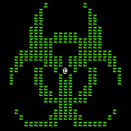

## A Rollercoaster of a Year

When I initially signed up for this course, I thought in my head, "hey, this class is gonna be pretty fun and relaxing; how hard can it be?". Well, my thoughts were
half correct. The course was indeed a bit fun; making websites and seeing your program go into fruition was pretty satisfying. However, it would get extremely
stressful at times; so in other words, I was dead wrong about this course being a relaxing one. Regardless, I found this course to be extremely beneficial
to furthering my skills in software engineering in general, as it has taught me much about the many important concepts of this field.

## Open Source Software Develop- Hey, I've Seen This Before!

Open source software development: it essentially means that you have a programming project that anyone can contribute to. It's out in the open for all to work on and because of this, it makes development much quicker and less arduous. With such a concept, a project can become much more than what it initially was thought to be. I can think of one instance of such a thing, one that I knew of before taking this course:

The image above is that of a logo of a game called "Cataclysm: Dark Days Ahead". The game is a survival game set in a post-apocalyptic world and it is, you guessed it, an open-sourced project. The game started off extremely simple, with it only having ascii art for graphics. Being open-source, it has evolved immensely over the years and is still being worked on to this day. It most certainly would not have gotten to this point had it not been open source. I've actually been thinking of making some contributions to my own, though I didn't really have the time. Maybe over the summer I'll do it, as taking this class has certainly taught me the ins and out of open source software development. The importance of collaboration is really highlighted by open source software development.

## Websites n' UI Development

I always wondered how websites were made, and thanks to this class I now know how it's done. I have to say, it is actually quite simple to do. One can easily make a website using something called html. The websites you can make with html are usually gonna end up looking really basic, that is where user interface frameworks come into place. With user interface frameworks, one can create much more sophisticated websites. An example of such a thing is a framework called Semantic UI, something that I used to make a websites with other students.  While making websites and using UI frameworks are simple enough, it is still extremely time consuming to make it look really nice and functional. I went into this thinking that it would be easy, but to my dismay it is a lot more tedious than I anticipated. So overall, like most things, software development is definitely possible to do on your own. However without and help or collaboration, it can get overwhelming.

The image above is me getting overwhelmed trying to make a copy of another website through Semantic UI... It was much harder than it looked.
