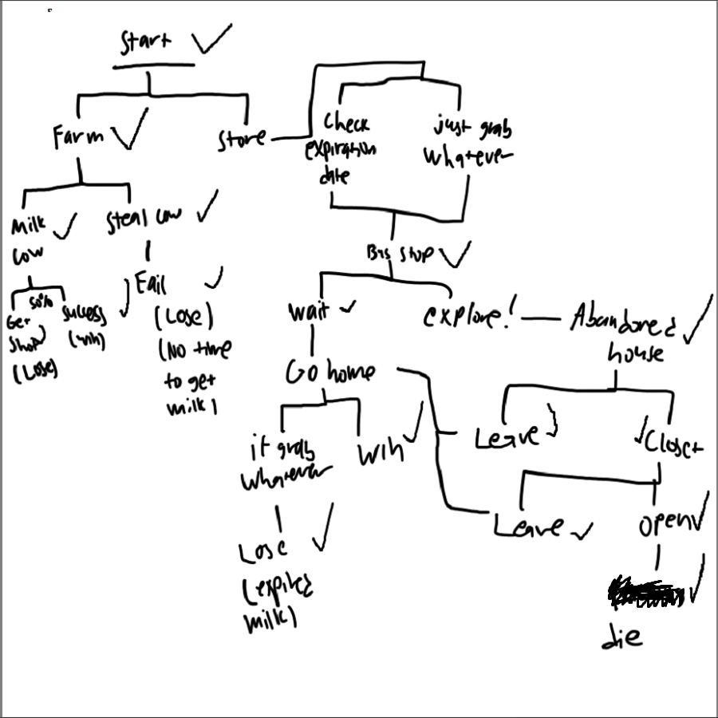

  
   

  
   

For ICS 111, my professor decided that it would be fun to have his students create a game as a final project for the semester. The kind of game was up to the student; as long as you could create the game within two weeks, you were allowed to choose whatever genre you wanted. Originally, I wanted to create a turn-based RPG for the project; but the more I thought about it, I realized it was a terrible idea considering that I came into this class knowing absolutely nothing about coding beforehand. So, I decided that a text-based adventure game would be more suitable for someone with my experience. I titled the game "Get Milk!" and the your objective is to get milk for your cereal. It plays out like any typical text-based adventure, and there's six endings. Everyone had to work independently, there weren't any groups.

Since this was an independent project, I was in charge of everything in the making of this game. Namely, I was in charge of coding everything and creating the game assets. Coding the game was fairly simple; I just made it so that all the relevant information was shown to the player, and that the player could click on a button to choose their next course of action. The game assets consisted of drawn visuals for both the scenes and the buttons (yes, the buttons themselves were drawn pngs overlayed on actual buttons). Most of the visuals were drawn on MS Paint with a mouse; the visuals that weren't were instead drawn on Krita with a drawing pad (not that it made it look any better honestly). Now, I could've just used stock images for my visuals, but I thought that it'd be much more fun to draw it all myself; even if it looked kind of bad.

From working on my game, I've obtained some experience with working with the Java GUI system (sort of). I learned how to illustrate imported images in my code, creating and using buttons for user input, and changing the properties of various things like text. Other than that, there wasn't much else I gained from this. I would put some sort of link to my game, but unfortunately all the code for it is long gone now. At least I still have the game assets though, as seen above. They're not good drawings, but I'm no artist; pay no mind that I listed drawing as one of my interests.

If you are curious about how the game is supposed to go, see the image below. It's a checklist I made during the time I was working on the game. I wasn't planning on showing this to anyone at the time, so I didn't care about making it neat.

