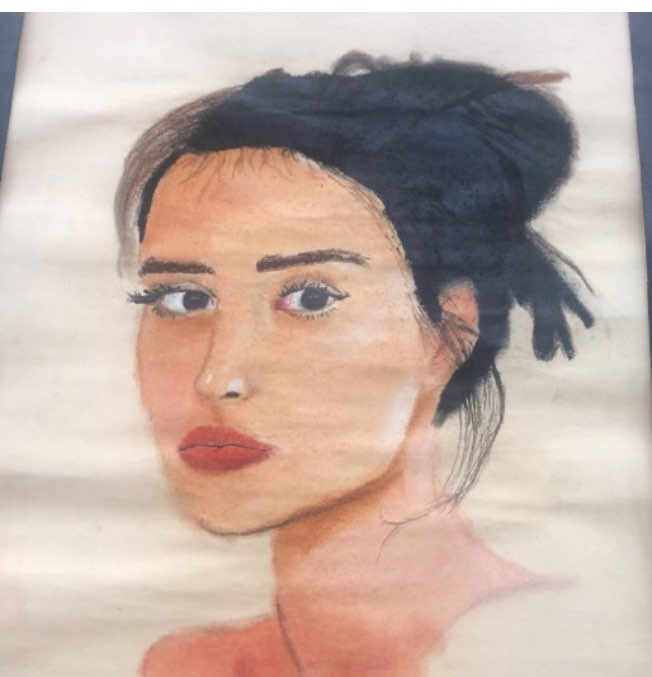

For drawing class we had to learn how to use various different mediums of art. One of them was coloring and blending with chalk pastel. The project was simple: find a portrait of someone and make a drawing of it colored with chalk pastel. There really isn't much else to it, just apply what you learned from previous projects to this one.

This was a solo project, so I had to do everything on my own. I found a portrait photo of a woman on google images and used it as a reference for my project. I sketched out her face until I felt that it turned out right, then I tried to color it in with various chalk pastels. The last part was a hassle and I made some mistakes that I couldn't easily fix; it resulted with the left eye looking longer than it should've looked. Overall, I was pretty happy with how it looked; that was until I messed it up when I had to spray it with hair spray to keep the dust from getting everywhere. I am still mad about that to this day.

Doing this project taught me a valuable lesson about sticking with a project to completion. Whenever I worked on coloring the drawing, I always had the thought that it didn't look right. But, with perserverance (and the fact that it was too late to start over), I ended up with something that I'm kind of proud of.
